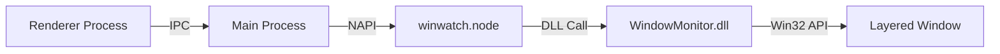

# Control Highlighter Feature Implementation

## Architecture Overview



## Implementation Approach

Based on the reference implementation in [ControlHighlithter.cpp](C:\y\c\dp\hid.dp.pm.native\src\PMAT\DPPmatHelper\ControlHighlithter.cpp), the highlighter uses:

- A **layered window** (`WS_EX_LAYERED | WS_EX_TOPMOST`) that sits on top of all windows
- `UpdateLayeredWindow` with `ULW_COLORKEY` to make the center transparent
- Timer-based blinking to flash the highlight rectangle

## Files to Modify/Create

### 1. Native DLL - New Highlighter Implementation

Create [native/src/ControlHighlighter.h](native/src/ControlHighlighter.h) and [native/src/ControlHighlighter.cpp](native/src/ControlHighlighter.cpp):

- Create a singleton highlighter class that manages a layered window on a worker thread
- Implement `HighlightRect(x, y, width, height, color, borderWidth, blinkCount)`
- Implement `HideHighlight()`
- Use `UpdateLayeredWindow` with color key transparency

Update [native/src/WindowMonitor.h](native/src/WindowMonitor.h):

- Add `HighlightRect` function with parameters: x, y, width, height, color (optional), borderWidth (optional), blinkCount (optional)
- Add `HideHighlight` function

Update [native/src/WindowMonitor.cpp](native/src/WindowMonitor.cpp):

- Implement the exported functions calling the highlighter singleton

Update [native/WindowMonitor.vcxproj](native/WindowMonitor.vcxproj):

- Add new source files to the project

### 2. NAPI Plugin Binding

Update [napi-plugin/src/binding.cpp](napi-plugin/src/binding.cpp):

- Add `HighlightRectWrapper` - accepts bounds object `{x, y, width, height}` and optional options `{color, borderWidth, blinkCount}`
- Add `HideHighlightWrapper`
- Export both functions in the module init

### 3. Electron Main Process

Update [electron/src/main/1-start-main-window/2-1-listeners-render-calls.ts](electron/src/main/1-start-main-window/2-1-listeners-render-calls.ts):

- Add IPC handler `highlight-rect` that calls `winwatchPlugin.highlightRect()`
- Add IPC handler `hide-highlight` that calls `winwatchPlugin.hideHighlight()`

### 4. Preload API

Update [electron/src/preload/index.ts](electron/src/preload/index.ts):

- Add `highlightRect(bounds, options?)` method
- Add `hideHighlight()` method

### 5. TypeScript Types

Update [electron/src/vite-typescript/preload-types.d.ts](electron/src/vite-typescript/preload-types.d.ts) (if exists) or create type definitions:

- Define `HighlightOptions` interface with optional `color`, `borderWidth`, `blinkCount`
- Extend the `api` type with new methods
- Define types for all calls to/from napi-plugin project in a separate file  

## Key Implementation Details from Reference

From the reference [ControlHighlithter.cpp](C:\y\c\dp\hid.dp.pm.native\src\PMAT\DPPmatHelper\ControlHighlithter.cpp):

```cpp
// Window styles for the highlighter
WS_POPUP, WS_EX_TOPMOST | WS_EX_LAYERED | WS_EX_TOOLWINDOW | WS_EX_NOACTIVATE

// Default parameters
BORDER_WIDTH = 5
HIGHLIGHT_COLOR = RGB(255, 0, 0)  // Red
TRANSPARENT_COLOR = RGB(0, 128, 128)  // For color key
BLINK_TIMES = 5  // Number of blinks
FLASH_TIME = 200ms  // Blink interval
```

The highlighter:

1. Creates a layered window on a worker thread with message loop
2. Draws a colored border with `FillSolidRect`
3. Makes center transparent using `UpdateLayeredWindow` with `ULW_COLORKEY`
4. Uses timer for blinking effect