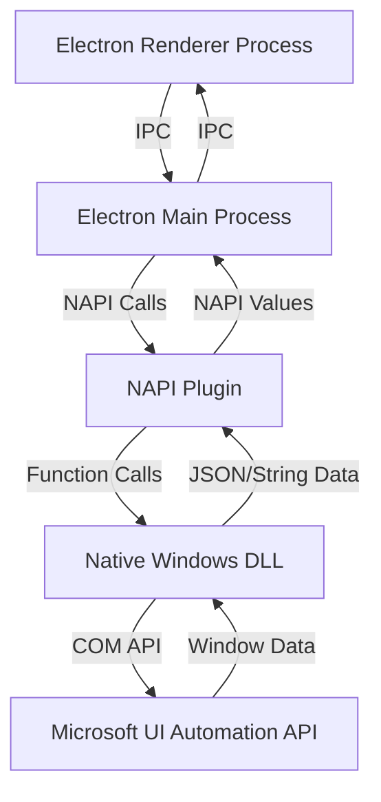
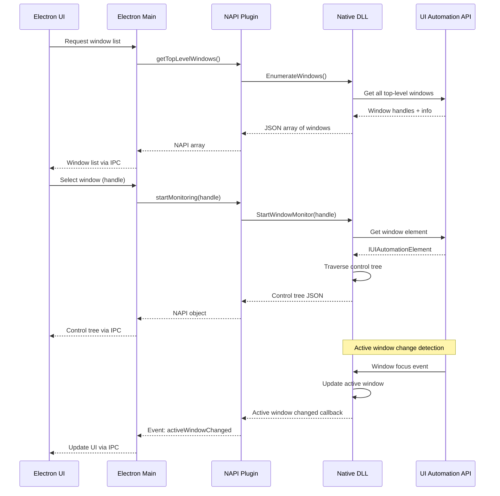

# Windows UI Automation Monitor Application

## Project Structure

```
win-watch-25/
├── electron/                    # Electron + React frontend
│   ├── src/
│   │   ├── main/               # Electron main process
│   │   ├── renderer/           # React renderer process
│   │   │   ├── components/     # React components
│   │   │   ├── hooks/          # Custom React hooks
│   │   │   └── App.tsx
│   │   └── preload/            # Preload scripts
│   ├── package.json
│   └── electron.vite.config.ts
├── native/                      # Native Windows DLL
│   ├── src/
│   │   ├── WindowMonitor.cpp   # Active window monitoring
│   │   ├── WindowList.cpp      # Top-level windows enumeration
│   │   ├── ControlTree.cpp     # UI Automation tree traversal
│   │   ├── ControlInfo.cpp     # Control property extraction
│   │   └── WindowMonitor.h
│   ├── WindowMonitor.vcxproj
│   └── WindowMonitor.sln
├── napi-plugin/                 # NAPI wrapper
│   ├── src/
│   │   ├── binding.cpp         # NAPI bindings
│   │   └── binding.h
│   ├── binding.gyp              # node-gyp config
│   ├── binding.vcxproj          # Visual Studio project
│   └── package.json
└── package.json                 # Root workspace package.json
```

## Component Layout

### Main Application Window

```
┌─────────────────────────────────────────────────────────────┐
│  WinWatch - UI Automation Monitor                    [─][□][×]│
├──────────────┬──────────────────────────────────────────────┤
│              │                                              │
│  Window Tree │         Active Window Controls               │
│  (Left)      │         (Right - Main Area)                  │
│              │                                              │
│  ▼ Desktop   │  ┌──────────────────────────────────────┐   │
│    ▼ Window1 │  │ Window: Notepad                     │   │
│    ▼ Window2 │  │ Handle: 0x00012345                  │   │
│    ▼ Window3 │  │ Process: notepad.exe                │   │
│      └─Child │  └──────────────────────────────────────┘   │
│              │                                              │
│  [Refresh]   │  ┌──────────────────────────────────────┐   │
│              │  │ Controls Tree:                       │   │
│              │  │ ▼ Document                           │   │
│              │  │   ▼ Edit                             │   │
│              │  │     ▼ Text                           │   │
│              │  │       └─ TextLine                    │   │
│              │  └──────────────────────────────────────┘   │
│              │                                              │
│              │  ┌──────────────────────────────────────┐   │
│              │  │ Selected Control Properties:          │   │
│              │  │ Name: "Text"                         │   │
│              │  │ Type: UIA_EditControlTypeId          │   │
│              │  │ AutomationId: "15"                    │   │
│              │  │ Bounds: {x:10, y:50, w:500, h:300}   │   │
│              │  │ ...                                   │   │
│              │  └──────────────────────────────────────┘   │
└──────────────┴──────────────────────────────────────────────┘
```

**Left Panel (Window Tree):**

- Collapsible tree view of all top-level windows
- Each window shows: window title, handle, process name
- Clicking a window switches active monitoring to that window
- Refresh button to update window list

**Right Panel (Main Area):**

- Top section: Current active window info (handle, process name, title)
- Middle section: Collapsible controls tree (UI Automation elements)
- Bottom section: Properties panel for selected control (similar to Spy++)

## Data Flow Architecture

### High-Level Data Flow



### Detailed Component Interaction



## Implementation Details

### 1. Native Windows DLL (`native/`)

**Key Files:**

- `WindowMonitor.h/cpp`: Core monitoring functionality
- `WindowList.h/cpp`: Enumerate top-level windows
- `ControlTree.h/cpp`: Traverse UI Automation tree
- `ControlInfo.h/cpp`: Extract control properties

**Key Functions:**

```cpp
// Get all top-level windows
std::string GetTopLevelWindows();

// Start monitoring a specific window
bool StartMonitoring(HWND hwnd);

// Get control tree for current active window
std::string GetControlTree();

// Get detailed info for a control
std::string GetControlInfo(int controlId);

// Callback for active window changes
typedef void (*ActiveWindowChangedCallback)(HWND hwnd);
void SetActiveWindowChangedCallback(ActiveWindowChangedCallback callback);
```

**Dependencies:**

- `uiautomation.h` (Microsoft UI Automation)
- `windows.h`
- JSON library (e.g., nlohmann/json or rapidjson)

### 2. NAPI Plugin (`napi-plugin/`)

**Key Functions:**

```cpp
// Get list of top-level windows
Napi::Value GetTopLevelWindows(const Napi::CallbackInfo& info);

// Start monitoring a window by handle
Napi::Value StartMonitoring(const Napi::CallbackInfo& info);

// Get control tree for active window
Napi::Value GetControlTree(const Napi::CallbackInfo& info);

// Get control properties
Napi::Value GetControlProperties(const Napi::CallbackInfo& info);

// Event emitter for active window changes
void EmitActiveWindowChanged(HWND hwnd);
```

**NAPI Module Export:**

```cpp
Napi::Object Init(Napi::Env env, Napi::Object exports) {
    exports.Set("getTopLevelWindows", Napi::Function::New(env, GetTopLevelWindows));
    exports.Set("startMonitoring", Napi::Function::New(env, StartMonitoring));
    exports.Set("getControlTree", Napi::Function::New(env, GetControlTree));
    exports.Set("getControlProperties", Napi::Function::New(env, GetControlProperties));
    return exports;
}
```

### 3. Electron Application (`electron/`)

**Main Process (`src/main/`):**

- Load NAPI plugin
- Expose IPC handlers for window operations
- Handle active window change events

**Renderer Process (`src/renderer/`):**

- React components using shadcn/ui:
  - `WindowTree.tsx`: Left panel tree view
  - `ControlTree.tsx`: Right panel controls tree
  - `PropertiesPanel.tsx`: Bottom properties display
  - `WindowInfo.tsx`: Top window info display
- Custom hooks:
  - `useWindowList.ts`: Fetch and manage window list
  - `useActiveWindow.ts`: Monitor active window changes
  - `useControlTree.ts`: Fetch and display control tree

**Technologies:**

- electron-vite (latest)
- React 18+
- Tailwind CSS v4
- shadcn/ui components
- TypeScript
- pnpm bundler
- vite (latest)

## Build Configuration

### Native DLL (`WindowMonitor.vcxproj`)

- Platform Toolset: v143 (VS 2022)
- Windows SDK: Latest
- C++ Language Standard: C++17 or later
- Additional Dependencies: `uiautomationclient.lib`

### NAPI Plugin (`binding.gyp` + `binding.vcxproj`)

- node-gyp configuration
- Link against native DLL
- Platform: win32
- Target: Node.js version from Electron

### Electron (`electron.vite.config.ts`)

- Main entry: `src/main/index.ts`
- Renderer entry: `src/renderer/index.html`
- Preload scripts for secure IPC

## Key Features

1. **Window List Tree**: Shows all top-level windows with collapsible children
2. **Active Window Monitoring**: Automatically detects and displays active window controls
3. **Control Tree**: Hierarchical view of UI Automation elements
4. **Control Properties**: Detailed properties panel (name, type, automation ID, bounds, process info, etc.)
5. **Control Highlighting**: Visual highlighting of controls on screen
6. **Control Invocation**: Ability to invoke controls (buttons, etc.)

## Data Structures

**Window Info:**

```typescript
interface WindowInfo {
  handle: string;        // Hex window handle
  title: string;
  processName: string;
  processId: number;
  className: string;
}
```

**Control Info:**

```typescript
interface ControlInfo {
  id: number;
  name: string;
  controlType: string;
  automationId: string;
  className: string;
  bounds: { x: number; y: number; width: number; height: number };
  isEnabled: boolean;
  isVisible: boolean;
  children: ControlInfo[];
}
```

## Next Steps

1. Set up project structure and workspace
2. Create native DLL with UI Automation API integration
3. Create NAPI plugin wrapper
4. Set up Electron app with electron-vite
5. Implement React components with shadcn/ui
6. Connect all parts with IPC and NAPI calls
7. Add control highlighting and invocation features